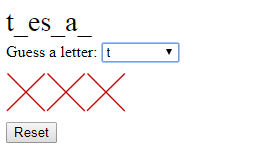

# Word Guessing Game in JavaScript

This is a word guessing game implemented in HTML/CSS/JavaScript with tests written in QUnit.

It's like Hangman but with less hanged men.

The game chooses a random word and displays the letters as blanks `_`.  You guess letters until you guess the word, or until you guess wrong 6 times.

The list of random words is modified from [dariusk/corpora](https://github.com/dariusk/corpora/blob/master/data/words/nouns.json).

## Running the Game

Clone the repository, then double-click on the `index.html` file.

## Running the Unit Tests

Clone the repository, then double-click on the `tests.html` file.

## Supported Browsers

* Chrome
* Firefox

The `<select>` attributes like `hidden` don't work in IE.  It also doesn't properly initialize in IE when running the tests.  IE is not supported.