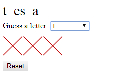

# Word Guessing Game

This is a word guessing game implemented in TypeScript/Next.js with Jest tests.

It's like Hangman, but with less hanged men.

The game chooses a random word and displays the letters as blanks `_`. You guess letters until you guess the word, or until you guess wrong 6 times. Use the dropdown to guess a letter.

The list of random words is modified from [dariusk/corpora](https://github.com/dariusk/corpora/blob/master/data/words/nouns.json).



## Running the Game

```
npm run dev
```

## Running the Unit Tests

```
npm test
```
